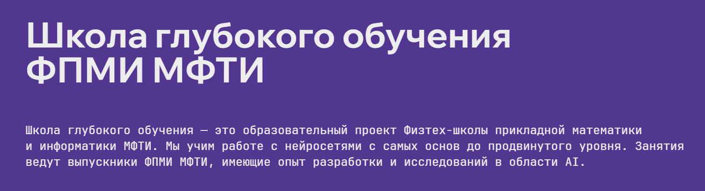

# Deep Learning School

В данном репозитории размещены материалы и выполненные проекты по курсу 2-го семестра - использованию нейросетевых моделей для обработки естественного языка и аудио

## Описание проектов:
| Номер проекта | Название и ссылка | Тема                                                             |
|---------------|-------------------|------------------------------------------------------------------|
|1              |[Лекция - Эмбеддинги слов](https://vk.com/video-155161349_456239178?t=0s&ref_domain=stepik.org)|Лекция - Введение в NLP|
|2              |[Семинар - Обработка и классификация текстов](https://vk.com/video-155161349_456239183?t=0s&ref_domain=stepik.org) |Семинар - Введение в NLP|
|3              |[Практика](https://colab.research.google.com/drive/1-0QviraBbIyE87RcgBv-TD_58mWgqTn3?usp=sharing) |Семинар - блокнот text_preprocessing_and_classification|
